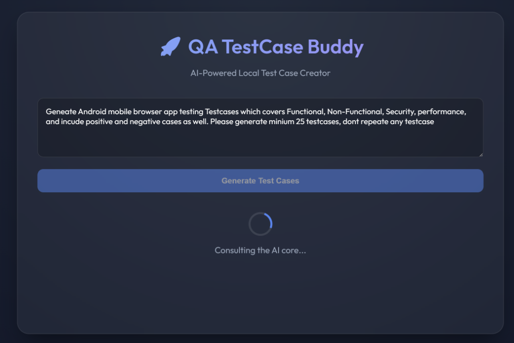
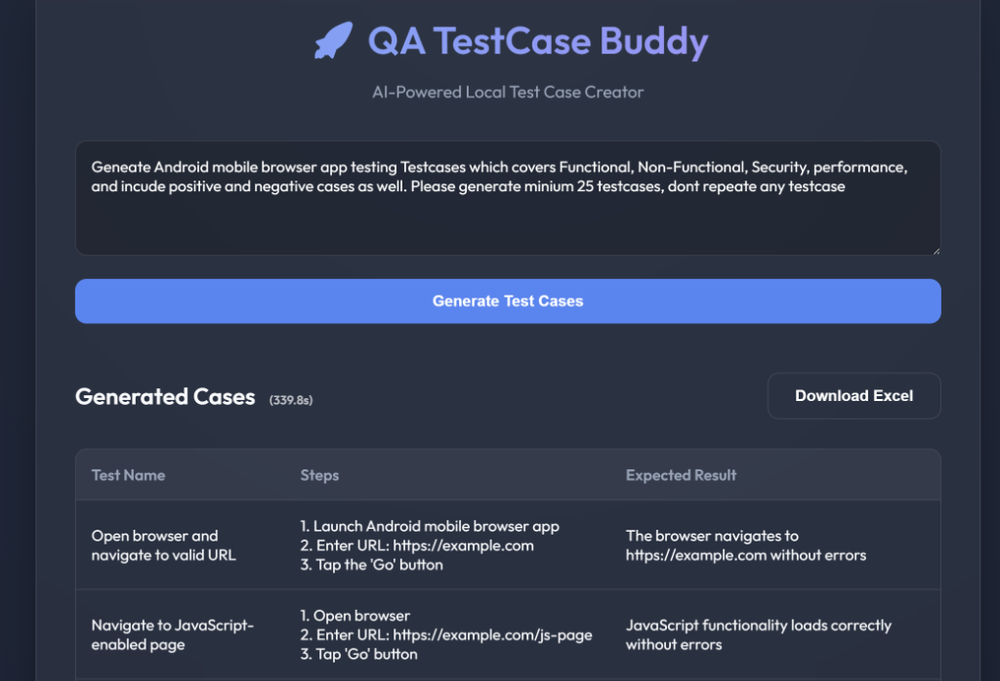

# 🚀 QA TestCase Buddy




## ✨ Overview
**QA TestCase Buddy** is a premium, AI-powered local tool designed to streamline the test case generation process. By leveraging the **Ollama `qwen3:4b`** model, it transforms raw requirements into structured, high-quality QA test cases in seconds.

Whether you prefer a lightning-fast **CLI** or a modern, glassmorphic **Web UI**, QA TestCase Buddy has you covered.

## 🛠️ Key Features
- **Instant Generation**: Convert complex feature descriptions into detailed test steps and expected results.
- **Dual Interface**: Use the terminal for quick tasks or the web dashboard for a visual experience.
- **Excel Export**: Download your generated cases directly into professional Excel spreadsheets.
- **Performance Tracking**: Built-in execution timer to monitor AI response speed.
- **Local & Private**: Runs entirely on your machine using Ollama—no data leaves your system.
- **Premium Design**: Dark mode aesthetic with smooth animations and a glassmorphic UI.

## 📋 Prerequisites
1. **Ollama**: Must be installed and running (`ollama serve`).
2. **Model**: Pull the required model:
   ```powershell
   ollama pull qwen3:4b
   ```
3. **Python 3.x**: Ensure Python is installed.
4. **Dependencies**:
   ```powershell
   pip install pandas openpyxl requests flask
   ```

## 🚀 Getting Started

### 1. Web Interface (Recommended)
1. Start the server:
   ```powershell
   python app.py
   ```
2. Open [http://localhost:5000](http://localhost:5000) in your browser.

### 2. CLI Mode
- **Interactive**: `python run_generator.py` (Type `DONE` when finished).
- **One-Liner**: `python run_generator.py "User login with 2FA"`

## 🔧 Internal Architecture
The project follows a robust 3-layer architecture:
- **Layer 1 (Architecture)**: Defined SOPs and logic workflows.
- **Layer 2 (Navigation)**: Flask routing and CLI decision logic.
- **Layer 3 (Tools)**: Deterministic Python engines for API interaction and Excel generation.

## 🤝 Troubleshooting
- **Empty Output**: If the model returns partial data, try simplifying the requirement prompt.
- **Excel Errors**: Ensure `test_cases.xlsx` is closed before generating new results.
- **Git Issues**: Ensure the `assets/` folder is included in your commits to see the header image.

---
*Built with ❤️ for QA Engineers who value speed and style.*
