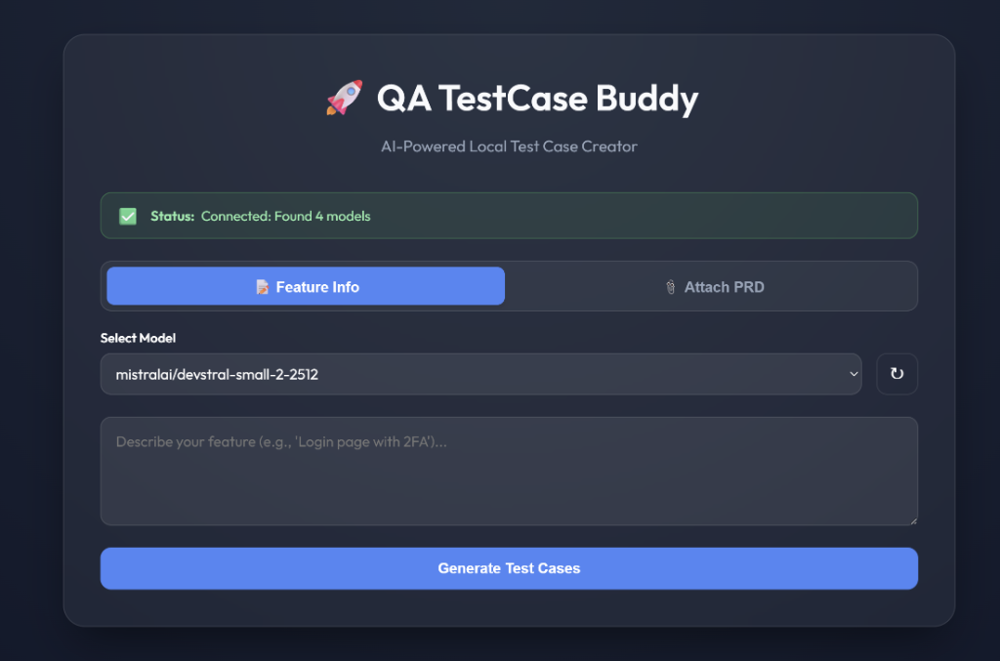
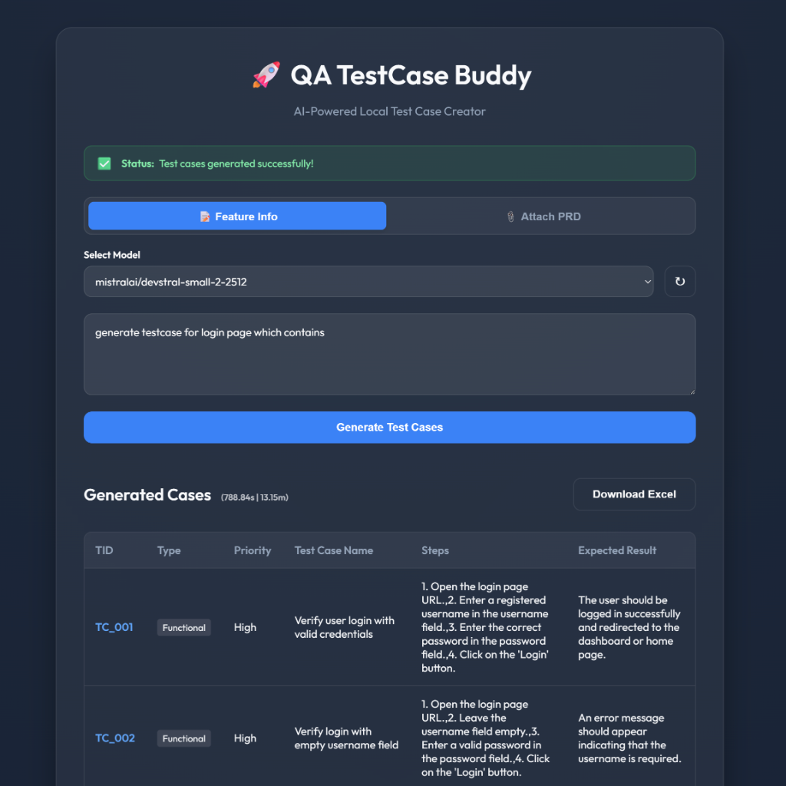

# 🚀 QA TestCase Buddy




## ✨ Overview
**QA TestCase Buddy** is a premium, AI-powered local tool designed to streamline the test case generation process. By leveraging **LM Studio** (OpenAI-compatible local server), it transforms raw requirements into structured, high-quality QA test cases in seconds.

Whether you prefer a lightning-fast **CLI** or a modern, glassmorphic **Web UI**, QA TestCase Buddy has you covered.

## 🛠️ Key Features
- **Instant Generation**: Convert complex feature descriptions into detailed test steps and expected results.
- **Smart Model Selection**: Automatically detects and lists available models from LM Studio using a dropdown.
- **Dual Input Modes**:
    1. **Feature Info**: Type requirements manually.
    2. **Attach PRD**: Upload requirement documents (**PDF, DOCX, TXT**) for context-aware generation.
- **Status Dashboard**: Real-time feedback box showing connection status and generation progress.
- **Excel Export**: Download your generated cases directly into professional Excel spreadsheets.
- **Performance Tracking**: Built-in execution timer to monitor AI response speed.
- **Local & Private**: Runs entirely on your machine using LM Studio—no data leaves your system.
- **Premium Design**: Dark mode aesthetic with smooth animations and a glassmorphic UI.

## 📋 Prerequisites
1. **LM Studio**: Must be installed and running.
   - **Start the Server**: Enable the Local Server in LM Studio (typically port `1234`).
   - **CLI Tool**: (Optional) Install the `lms` CLI tool so the app can auto-start the server.
   - **Load a Model**: Load a model (e.g., **Mistral**, Llama 3) in LM Studio before running the tool.
2. **Python 3.x**: Ensure Python is installed.
3. **Dependencies**:
   ```powershell
   pip install pandas openpyxl requests flask pypdf python-docx
   ```

## 🚀 Getting Started

### 1. Web Interface (Recommended)
1. Start the server:
   ```powershell
   python app.py
   ```
2. Open [http://localhost:5000](http://localhost:5000) in your browser.
3. **Connect**: The app will auto-connect to LM Studio. If not, the Status Box will guide you.
4. **Select Input**: Toggle between "Feature Info" (Text) or "Attach PRD" (File Upload).
5. **Generate**: Click the button and watch the magic happen!

### 2. CLI Mode
- **Interactive**: `python run_generator.py` (Type `DONE` when finished).
- **One-Liner**: `python run_generator.py "User login with 2FA"`

## 📂 Project Structure

```text
AITestGenerator/
├── architecture/          # Layer 1: System SOPs & Logic Workflows
│   └── generation_workflow.md
├── assets/                # UI Screenshots & Media
├── static/                # Frontend Styling (CSS)
├── templates/             # HTML Templates (Flask)
├── tools/                 # Layer 3: Deterministic Python Engines
│   ├── generate_test_cases.py # AI Integration Logic
│   ├── file_parser.py         # PDF/DOCX/TXT Parsers
│   ├── save_to_excel.py       # Excel Export Engine
│   ├── handshake.py           # Connection Verification
│   └── debug_model.py         # Model Testing Utility
├── .tmp/                  # Temporary Workbench (Intermediate files)
├── app.py                 # Web Application Entry Point (Flask)
├── run_generator.py       # CLI Application Entry Point
├── BLAST.md               # Project Protocol & Master Prompt
├── gemini.md              # Project Constitution & State Tracking
├── task_plan.md           # Phase Tracking & Goal Checklists
├── progress.md            # Execution Logs & Results
├── findings.md            # Research & Constraints
└── README.md              # Project Documentation
```

## 🔧 Internal Architecture
The project follows a robust 3-layer architecture:
- **Layer 1 (Architecture)**: Defined SOPs and logic workflows.
- **Layer 2 (Navigation)**: Flask routing and CLI decision logic.
- **Layer 3 (Tools)**: Deterministic Python engines for API interaction and Excel generation.

## 🤝 Troubleshooting
- **Empty Output**: If the model returns partial data, try simplifying the requirement prompt.
- **Excel Errors**: Ensure `test_cases.xlsx` is closed before generating new results.
- **Git Issues**: Ensure the `assets/` folder is included in your commits to see the header image.

---
*Built with ❤️ for QA Engineers who value speed and style.*
