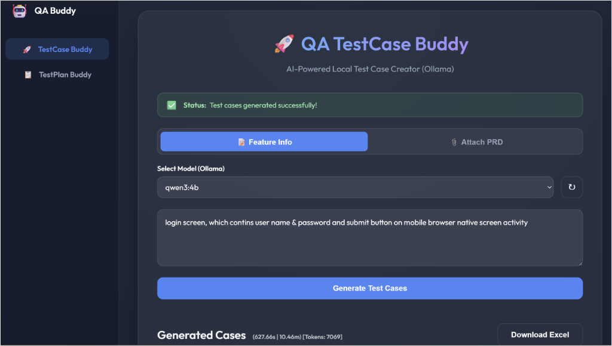
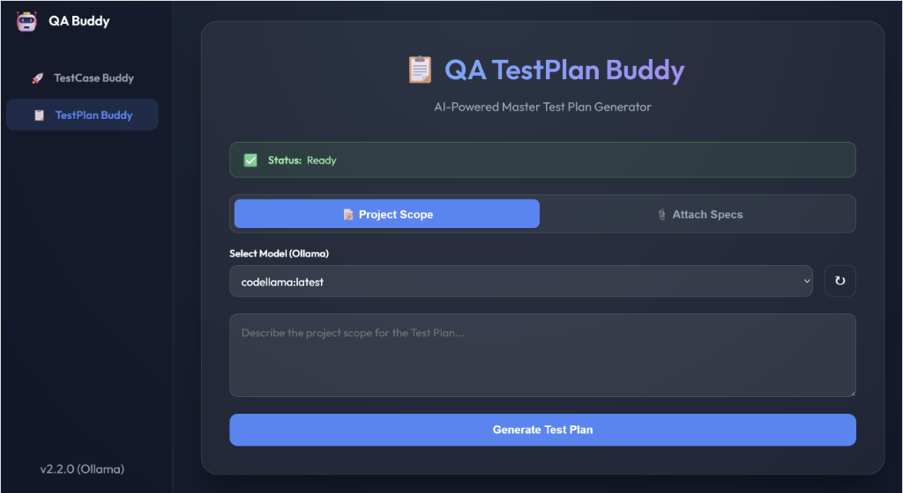

# **AI_QABuddy** - Local AI Test Case & Plan Generator using Ollama

## Overview
This is a secure, privacy-first web application that generates **Software Test Cases** and **Test Plans** using local Large Language Models (LLMs) via **Ollama**. It ensures that your sensitive Requirement Documents (PRDs) and data never leave your local machine.

**New in v2.2:**
*   **Ollama Native**: Optimized for local Ollama instances (defaulting to Port 11434).
*   **Dual-mode**: "TestCase Buddy" for creating valid Excel test cases and "TestPlan Buddy" for generating comprehensive, 10-section Test Strategy documents.
*   **Export Options**: Download Test Plans as editable **Word (.docx)** documents or **PDFs**.
*   **Robust JSON Repair**: Advanced self-healing logic to handle truncated or malformed LLM outputs.

## prerequisites
1.  **Python 3.8+**
2.  **Ollama**: Installed and running locally. [Download Ollama](https://ollama.com/)
    *   Ensure you have pulled a model (e.g., `ollama pull llama3`).

## Installation

1.  Clone this repository:
    ```bash
    git clone https://github.com/RavindraSHirandagi/AI_QABuddy.git
    cd AI_QABuddy
    ```

2.  Install dependencies:
    ```bash
    pip install -r requirements.txt
    ```

## Usage

1.  **Start Ollama**:
    Ensure Ollama is running in the background. It should be listening on `http://localhost:11434`.

2.  **Start the Application**:
    ```bash
    python app.py
    ```

3.  **Open Browser**:
    Navigate to `http://localhost:5000`.

## Features

### 1. Test Case Buddy


*   **Input**: Paste requirements text or upload files (PDF, DOCX, TXT).
*   **Generation**: Creates detailed test cases with Columns: `TID`, `TestType`, `Priority`, `TestCaseName`, `Steps`, `Expected_Result`.
*   **Export**: Download as **Excel (.xlsx)**.

### 2. Test Plan Buddy


*   **Input**: High-level scope or requirement documents.
*   **Generation**: Creates a standard **10-Section Test Plan** including:
    1.  Introduction & Overview
    2.  Scope (In/Out)
    3.  Test Strategy
    4.  Environment & Data
    5.  Pass/Fail Criteria
    6.  Deliverables
    7.  Schedule
    8.  Roles
    9.  Risks
    10. Approvals
*   **Export**: Download as **Word (.docx)** or **PDF**.

## Configuration
*   **Port**: The tool defaults to Ollama on `localhost:11434`.
*   **Models**: The tool automatically detects available models from your Ollama instance.

## Project Structure

```
AI_QABuddy/
├── .gitignore
├── app.py                  # Main Flask application
├── requirements.txt        # Python dependencies
├── run_generator.py        # Script to run generators
├── README.md               # Project documentation
├── architecture/           # Documentation on internal flows
│   ├── generation_workflow.md
│   ├── test_case_flow.md
│   └── test_plan_flow.md
├── assets/                 # Images and static assets for documentation
│   ├── test_case_ui.png
│   ├── test_plan_ui.png
│   └── ...
├── static/                 # Static files for the web app
│   └── style.css
├── templates/              # HTML templates
│   └── index.html
└── tools/                  # Helper scripts and logic
    ├── debug_model.py
    ├── file_parser.py
    ├── generate_test_cases.py
    ├── generate_test_plan.py
    ├── handshake.py
    ├── llm_config.py
    ├── save_to_docx.py
    ├── save_to_excel.py
    └── save_to_pdf.py
    
```

## Troubleshooting

*   **"Read timed out"**: Generation is taking longer than 33 minutes. Try using a smaller model or reducing the scope.
*   **JSON Errors**: The tool attempts to auto-repair malformed JSON. If it fails, check the console logs for the raw output.
