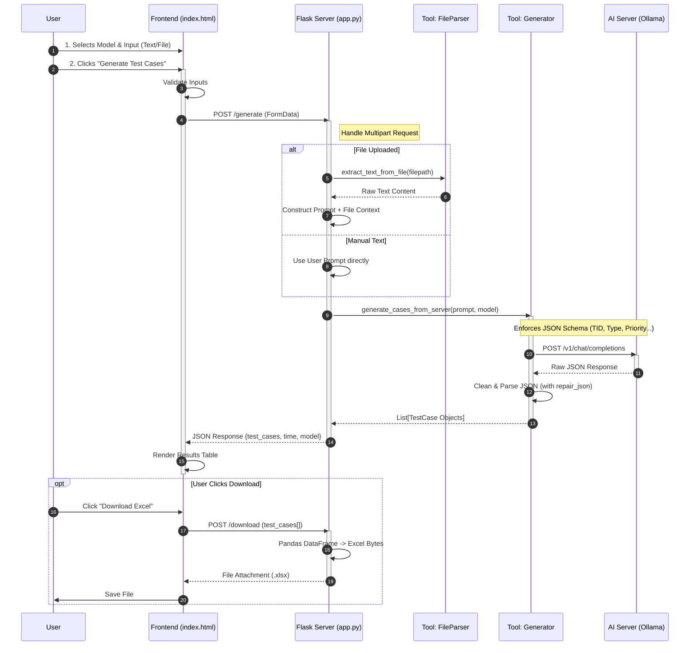

# System Architecture: Test Case Generation Flow

This document visualizes the end-to-end data flow for generating test cases using **QA TestCase Buddy**.

## Sequence Diagram

## Key Modules

1.  **Frontend (`index.html`)**: Handles state (input mode, model selection) and renders the response.
2.  **Backend (`app.py`)**: Orchestrator that routes requests and manages temporary files.
3.  **File Parser (`file_parser.py`)**: Extracts text from PDF, DOCX, and TXT files.
4.  **Generator Tool (`generate_test_cases.py`)**: Manages the LLM prompt engineering and JSON validation.
5.  **AI Server (Ollama)**: Local inference server (Port 11434).
