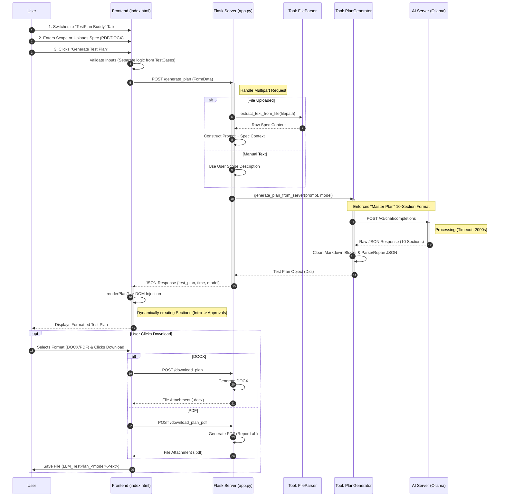

# System Architecture: Test Plan Generation Flow

This document visualizes the end-to-end data flow for generating a Master Test Plan using **QA TestPlan Buddy**.

## Sequence Diagram

## Key Differences from Test Case Flow

1.  **Endpoint**: Uses `/generate_plan` instead of `/generate`.
2.  **Tooling**: Uses `generate_test_plan.py` which has specific logic for longer timeouts (33 mins) and robust JSON repair.
3.  **Strict Structure**: The prompt enforces a strict **10-Section Standard** (Introduction, Scope, Strategy, Environment, Pass/Fail, Deliverables, Schedule, Roles, Risks, Approvals).
4.  **Rendering**: The UI renders a structured document view.
5.  **Dual Export**: Supports both DOCX and PDF export.
